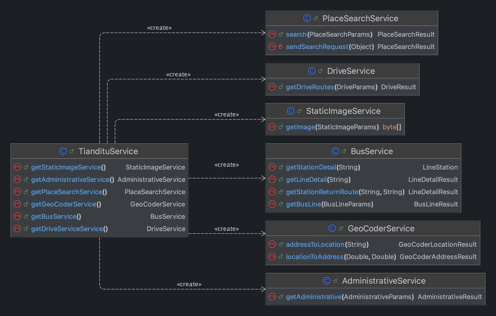

# 天地图WEB服务API调用SDK

JAVA 实现的天地图WEB服务API调用SDK

官方文档地址：[http://lbs.tianditu.gov.cn/server/guide.html](http://lbs.tianditu.gov.cn/server/guide.html)

## 特点

- 简单易用
- 尽可能覆盖所有接口
- 参数/结果尽可能的还原原始文档说明

## 使用

```shell
# build.gradle

repositories {
    maven { url "https://jitpack.io" }
}
dependencies {
    implementation 'com.github.DennisGuo:tianditu-web-sdk:master-SNAPSHOT'
}
```

## 接口实现

- [x] 地名搜索V2.0 `PlaceSearchService`
- [x] 地理/逆地理编码接口 `GeoCoderService`
- [x] 行政区划服务V2.0 `AdministrativeService`
- [x] 公交规划 `BusService`
- [x] 驾车规划 `DriveService`
- [x] 静态地图API `StaticImageService`

## SDK类方法关系图



## 使用示例

```java
import cn.ghx.tianditu.TiandituService;
import cn.ghx.tianditu.coder.data.GeoCoderAddressResult;

/**
 * 逆地理编码查询
 * 提供将坐标点（经纬度）转换为结构化的地址信息的功能
 */
@Test
void locationToAddressTest() throws IOException {

    String tk = "xxxx";

    TiandituService service = new TiandituService(tk);

    Double lon = 106.979513;
    Double lat = 29.254591;

    GeoCoderAddressResult res = service.getGeoCoderService().locationToAddress(lon, lat);
    // print(res);
}

```